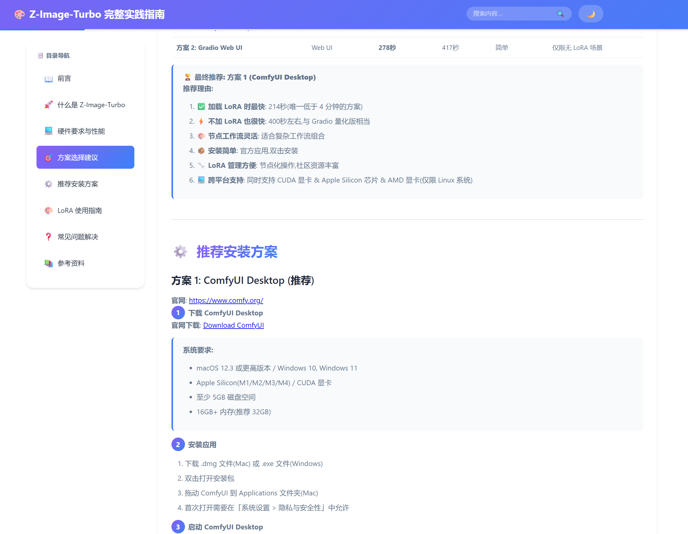
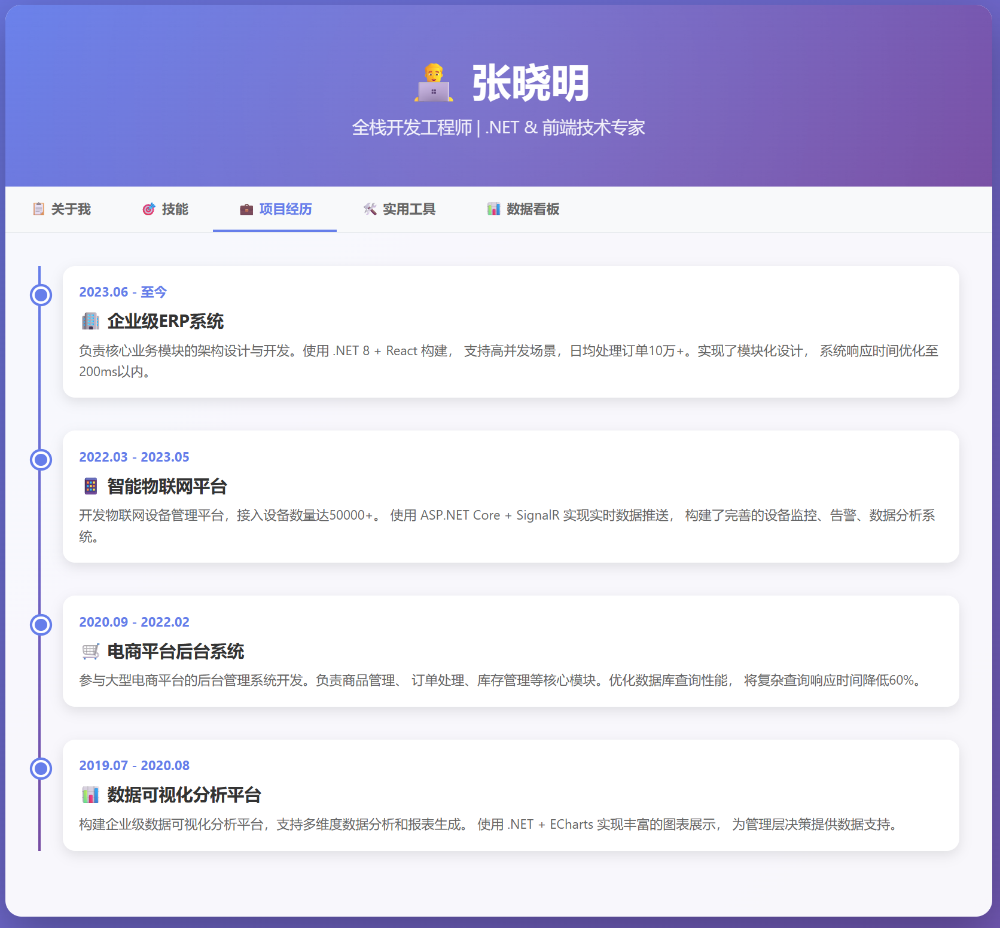
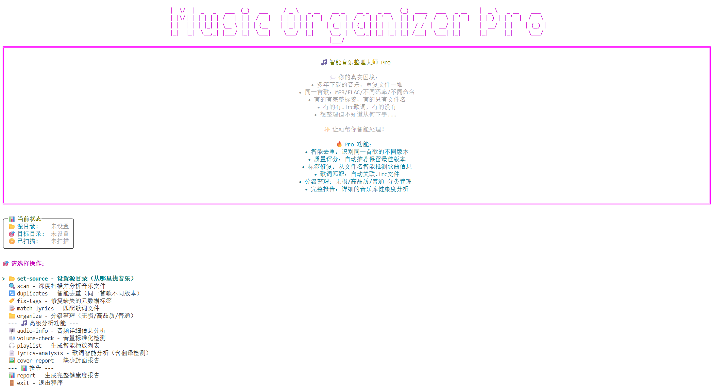

# C# File-Based Scripts Collection (C# 单文件脚本集)

这是一个基于文件的 C# 程序（File-based apps）的 Demo 演示和有用脚本收集项目。旨在探索 C# 14 & .NET 10 这一特性的创新应用。

## 技术简介

**基于文件的应用** 是 .NET 10 引入的一种简化模式，允许程序包含在单个 `*.cs` 文件中，无需 `.csproj` 项目文件即可直接编译运行。它支持完整的 C# 功能，包括顶级语句、NuGet 包引用（通过 `#:package`）和 SDK 指定（通过 `#:sdk`）。

## 🌟 Demo 案例展示

本项目包含多个展示单文件应用潜力的创新案例：

### 1. 单文件 Web 应用
打破传统 Web 项目复杂的结构，在一个文件中启动完整的 Web 服务。

### 2. 动态文档生成 (HelloTutorial)

将 Markdown 文档动态转换为美观的单页教程网页，展示了单文件应用在轻量级内容服务上的优势。

### 3. 交互式简历 (HelloVitae)

一个单页、可交互的漂亮简历页面。无需部署复杂的网站，运行脚本即可展示个人主页。

### 4. 桌面自动化 RPA (HelloWindowsNotePad)

<video src="(https://github.com/user-attachments/assets/835569d0-f64b-4536-9019-a32a5522aa5a" controls width="100%" height="auto"></video>

演示如何调用 Windows 桌面 API，模拟用户键盘和鼠标操作（如自动操作记事本），实现轻量级的 RPA（机器人流程自动化）功能。

### 5. 智能工具 (SmartMusicOrganizer)

一个实用的控制台应用，用于自动整理和分类音乐文件，展示了其作为系统管理工具的便捷性。

## 如何使用

### 1. 环境准备
首先，请确保安装了 **.NET 10 SDK** 或更高版本。

### 2. 运行脚本
在命令行中直接运行：

```bash
dotnet run your-script.cs
# 或者
dotnet your-script.cs
```

### 3. Unix/macOS 进阶用法
在 Unix 系统上，支持 Shebang (`#!`) 指令。你可以赋予脚本执行权限并直接运行：

```bash
# 添加执行权限
chmod +x your-script.cs

# 直接运行
./your-script.cs
```

## AI 辅助开发

此类单文件应用结构简单、上下文集中，非常适合由 AI 辅助开发，甚至根据需求全自动生成。

由于这是 .NET 10 (2025年发布) 的新特性，部分 AI 模型可能尚未更新相关知识。你可以通过以下两种方式让 AI 协助你：

1.  **使用 MCP 服务**：如果你的 AI 助手支持 Microsoft Learn 的 MCP 服务，请让它参考最新的 .NET 10 文档。
2.  **使用专用 Prompt**：我准备了一个包含必要技术背景的 Prompt。你可以将 [AI_PROMPT](./AI_PROMPT.md) 中的内容发送给 AI，它就能理解并生成符合规范的代码。

## 开发工具推荐

推荐使用 **VS Code** 进行开发：
- 安装 C# 和 C# Dev Kit 插件。
- 在设置中启用 `Dotnet > Projects: Enable File Based Programs` 以获得最佳体验（如断点调试支持）。
